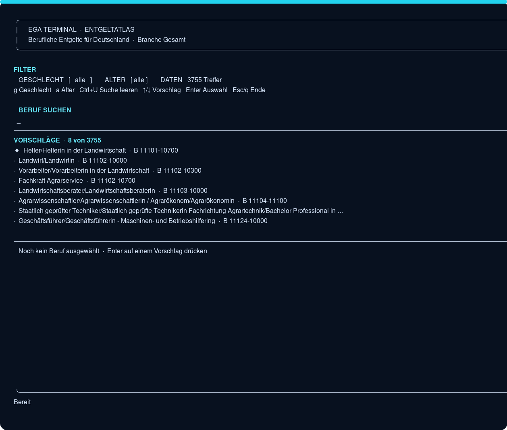
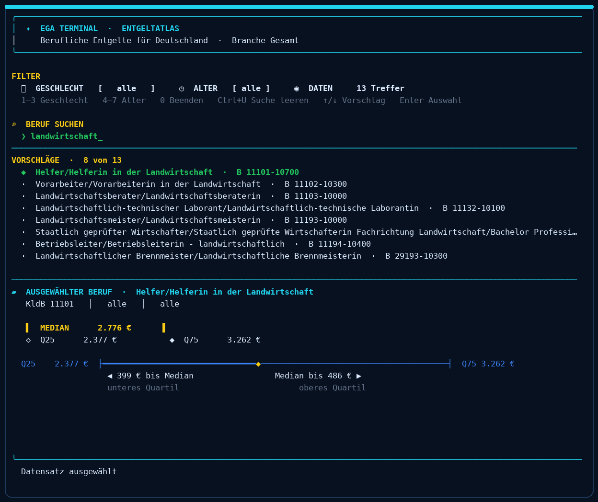
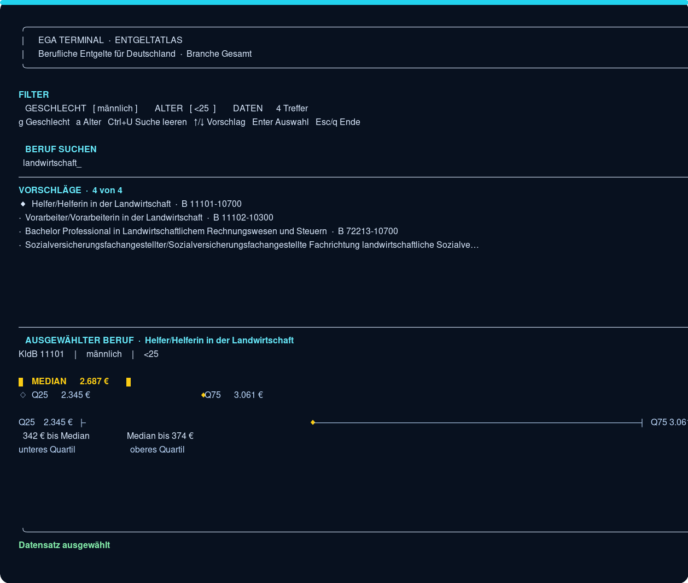

# egaterm – Terminalprogramm für den Entgeltatlas

egaterm ist eine kleine Terminal-Anwendung für Berufsdaten und Entgeltinformationen aus dem Entgeltatlas der Bundesagentur für Arbeit.

Die Anwendung ist für den schnellen Blick gedacht: Beruf suchen, Datensatz auswählen und Median sowie Quartile anzeigen lassen.

## Schnellstart

Voraussetzung ist Python 3.10 oder neuer.

```bash
git clone https://github.com/shadowframe/ega.git
cd ega
python3 -m venv data/.venv
data/.venv/bin/python egaterm.py
```

Die TUI verwendet nur die Python-Standardbibliothek. Zusätzliche Pakete sind nicht nötig.

Falls `python3 -m venv` auf Debian oder Ubuntu wegen `ensurepip` fehlschlägt, installiere zuerst das passende Paket:

```bash
sudo apt install python3-venv
```

Bei einer versionsspezifischen Python-Installation kann außerdem ein Paket wie `python3.14-venv` erforderlich sein.

## Die Terminal-Oberfläche

`egaterm.py` lädt `data/ega.json` und bietet:

- Suche mit Autosuggest nach Berufsbezeichnungen
- Auswahl eines Berufs mit vorhandenen Entgeltdaten
- Filter nach Geschlecht: `alle`, `männlich`, `weiblich`
- Filter nach Altersgruppe: `alle`, `<25`, `25-54`, `>54`
- Median, unteres Quartil und oberes Quartil
- eine grafische Darstellung der Abstände zwischen Q25, Median und Q75
- das mehrzeilige `egaTERM`-Logo

Der Median wird als Marker zwischen dem unteren und oberen Quartil dargestellt. Zusätzlich zeigt die Karte die beiden Abstände als Eurobeträge.

### Bedienung

| Taste | Funktion |
|---|---|
| Text eingeben | Beruf suchen |
| `↑` / `↓` | Vorschlag auswählen |
| `Enter` | Datensatz auswählen |
| `1` | Geschlecht: alle |
| `2` | Geschlecht: männlich |
| `3` | Geschlecht: weiblich |
| `4` | Alter: alle |
| `5` | Alter: <25 |
| `6` | Alter: 25-54 |
| `7` | Alter: >54 |
| `Ctrl+U` | Suchfeld leeren |
| `0` | Anwendung beenden |
| `q` | normales Suchzeichen |

`q` beendet die Anwendung nicht. Zum Beenden ist ausschließlich `0` vorgesehen.

### Screenshots

Die Screenshots stammen aus der laufenden TUI. Sie zeigen die wichtigsten Ansichten und bleiben Teil der Projektdokumentation.

#### Startansicht mit Autosuggest



#### Ausgewählter Beruf mit Entgeltkarte



#### Geschlechts- und Altersfilter



### Self-Test

```bash
data/.venv/bin/python egaterm.py --self-test
```

## Daten aktualisieren

Die mitgelieferte `data/ega.json` reicht für den normalen Start aus. Wenn die Quelldaten oder Entgeltwerte neu erzeugt werden sollen, kann die komplette Datenpipeline gestartet werden:

```bash
data/.venv/bin/python data/main.py --plain
```

Dabei passiert Folgendes:

1. Die aktuellen DKZ-Dateien werden geladen und geprüft.
2. Daraus entsteht eine bereinigte Berufeliste.
3. Der Entgeltatlas-Client liest den öffentlichen Client-Key automatisch von der Entgeltatlas-Webseite.
4. Die Entgeltwerte werden abgefragt und in `data/ega.json` geschrieben.

Du musst dich nicht anmelden und keinen Key aus einer Browsersitzung kopieren. Der Key wird nur während des Laufs verwendet. Er wird weder angezeigt noch in einer Datei gespeichert.

Eine ausführliche Beschreibung der Datenpipeline steht in [`data/README.md`](data/README.md).

## Nur einzelne Schritte ausführen

Bereinigte Berufeliste erzeugen:

```bash
cd data
.venv/bin/python create_data.py
```

Entgeltwerte abrufen:

```bash
cd data
.venv/bin/python crawler.py
```

Danach die Oberfläche wieder aus dem Projektverzeichnis starten:

```bash
data/.venv/bin/python egaterm.py
```

Für Tests oder einen expliziten alternativen Client-Key kann `ENTGELTATLAS_API_KEY` gesetzt werden:

```bash
export ENTGELTATLAS_API_KEY='...'
data/.venv/bin/python data/crawler.py
```

Der frühere Parameter `--api-key` wird bewusst nicht verwendet, damit der Wert nicht in Shell-History oder Prozesslisten landet.

## Projektstruktur

```text
DKZ XLSX + DKZ XML
        │
        ▼
create_data.py
        │
        ▼
berufe_bereinigt.json
        │
        ▼
crawler.py + Entgeltatlas-API
        │
        ▼
ega.json
        │
        ▼
egaterm.py
```

Wichtige Dateien:

- `egaterm.py` – interaktive Terminal-Oberfläche
- `data/main.py` – komplette Datenpipeline
- `data/catch_source.py` – lädt die offiziellen DKZ-Quelldateien
- `data/create_data.py` – bereinigt und verbindet die DKZ-Daten
- `data/entgeltatlas_client.py` – holt den öffentlichen Client-Key
- `data/crawler.py` – ergänzt die Berufeliste um Entgeltwerte
- `data/berufe_bereinigt.json` – bereinigte Berufeliste
- `data/ega.json` – Berufeliste mit Entgeltwerten
